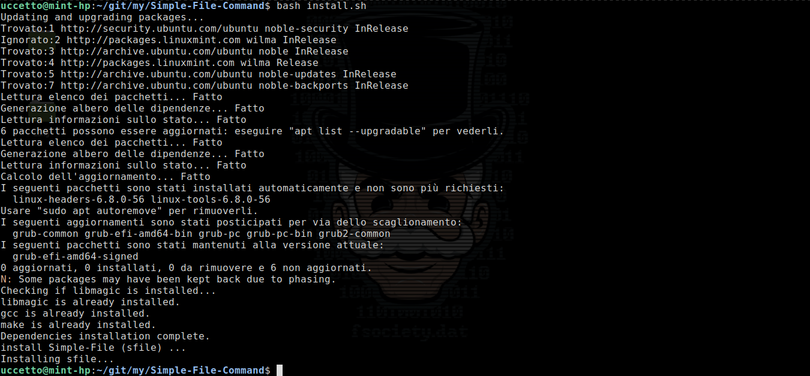
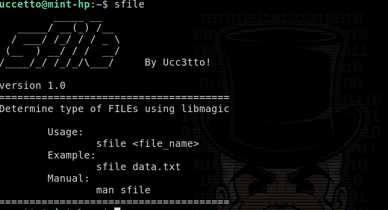
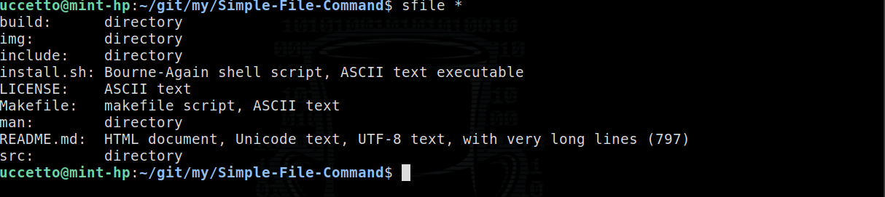
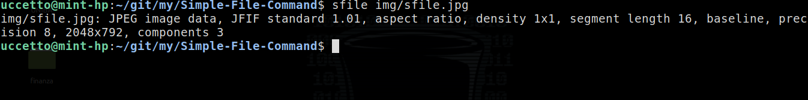
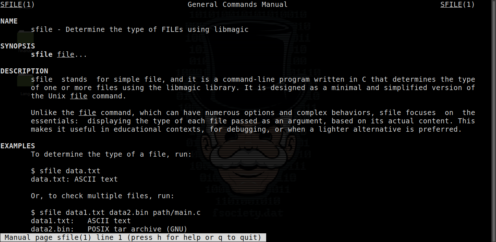

<h1 align = "center"> Simple-File (sfile) </h1>
<h1 align = "center">
    
</h1>
<hr>

<h3>Index </h3>
<ol>
    <li><a href='#t1'>Introduction</a></li>
    <li><a href='#t2'>Requires System</a></li>
    <li><a href='#t3'>Installation</a></li>
    <li><a href='#t4'>Use</a></li>
    <li><a href='#t5'>Uninstallation</a></li>
</ol>

<hr>

<a name="t1"></a>

## 1. Introdution 🚀

**SFILE**, stands for **S**imple **File**, and it is a command-line program written in C that determines the type of one or more files using the libmagic library. It was created as a lightweight and educational alternative to the Unix file command. The idea for sfile came from a simple question: how does the file command know what type a file is? To explore this, sfile was written from scratch with minimal complexity, focusing solely on the core functionality identifying the file type based on its content. Unlike the original file command, which includes many options and handles a wide range of use cases, sfile aims to keep things simple and transparent. This makes it especially useful in learning environments, basic scripts, or scenarios where a small, focused tool is more appropriate.

<a name="t2"></a>

## 2. Requires System 🖥️

1) **Operation System:** GNU/Linux - Unix

2) **Package Manager:** pacman || apt || dnf || yum

3) **package dependencies:** libmagic-dev || libmagic-devel || libmagic  && gcc && make

<a name="t3"></a>

## 3. installation 📥 🙂

1) clone the repository

```bash
git clone https://github.com/antogit-sys/Simple-File-Command.git
```

2. go to Simple-File-Command/

```bash
cd Simple-File-Command/
```

3. install sfile

```bash
bash install.sh
```

 or

```bash
chmod +x install.sh
./install.sh
```



```bash
$ sfile
```



<a name="t4"></a>

## 4. Use 🛠️

example:

```bash
$ sfile *
```



or

```bash
sfile img/
```



for more information, type:

```bash
$ man sfile
```



<a name="t5"></a>

## 5. Uninstallation SFILE 🗑️😡

go to Simple-File-Command directory

```bash
cd Simple-File-Command/
```

Run:

```bash
make uninstall
```


> 
